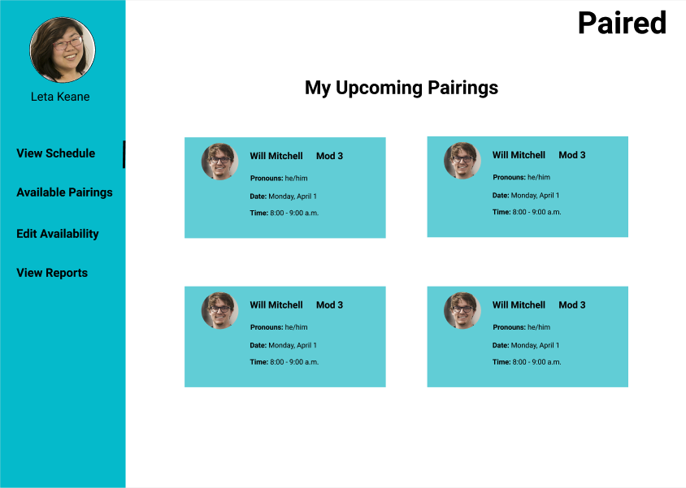
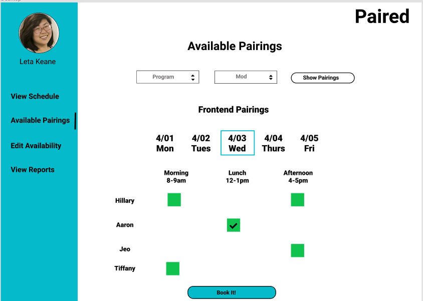

# [Paired](https://www.paired.tech/)

Paired is an application to improve pair programming between [Turing](https://turing.io/) students throughout their 7 month immersive program. This application was inspired by the current process of pairing with fellow peers which includes a clunky google sheet. As a team, we sought to understand the current pain points through user focused research and used the feedback to guide our iterations. Paired allows students to pair across modules and programs, set and modify their availability, and book pairings with fellow Turing students.

### See it Live:

https://www.paired.tech/

### Setting up the development environment:

#### Front End

`git clone https://github.com/hillstew/paired-fe.git`  
Run `npm install` from the root directory  
Run `npm start` and visit localhost:3000 in your browser

#### Back End

Associated backend repo can be found [here](https://github.com/dForDeveloper/paired-api)

### Primary Technologies Used:

- React
- Redux
- React Router
- SCSS

### Testing

- Jest
- Enzyme

### Preview of Paired:

#### Wireframes:

## Original Assesment

[Cross Pollination Spec](http://frontend.turing.io/projects/capstone.html) project from Turing School of Software & Design.

## Contributors

**Front End Team**  
[Hillary Stewart](https://github.com/hillstew)  
[Tiffany Bachmann](https://github.com/trbachmann)

**Back End Team**  
[Jeo D](https://github.com/dForDeveloper)  
[Aaron Roberts](https://github.com/jaaronbr)
